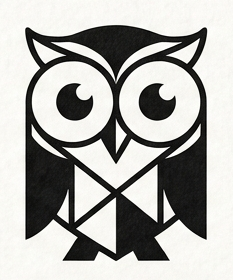
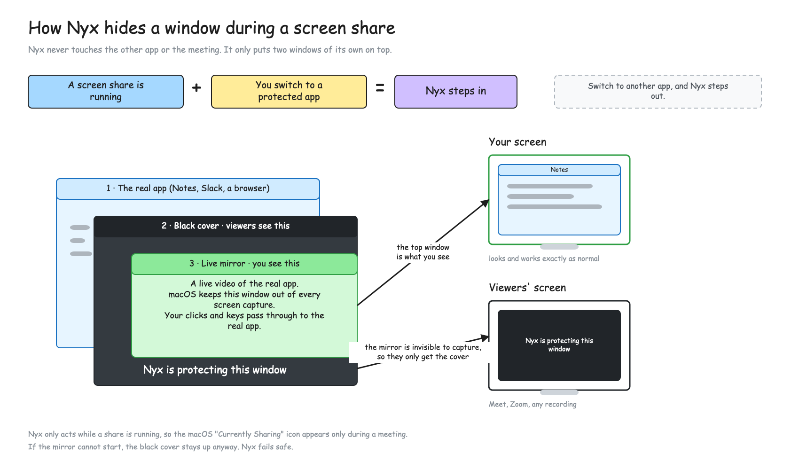

<div align="center">



# Nyx

**Share your screen, not everything on it.**

Nyx blacks out the apps and sites you choose whenever something is capturing your screen.<br>
You keep using them normally — viewers see a placeholder.

[](https://github.com/aristocrat71/nyx/releases/latest)
[](https://github.com/aristocrat71/nyx/releases)


</div>

---

## Install

```sh
curl -fsSL https://raw.githubusercontent.com/aristocrat71/nyx/nyx-v0.1.1/install.sh | bash
```

Downloads the latest DMG, **verifies its published SHA-256 checksum**, and installs to `/Applications` — aborting if the checksum is missing or doesn't match. The URL is pinned to a release tag, not a moving branch, so you can read the script at that URL before running it. Pin a version with `NYX_VERSION=nyx-vX.Y.Z`.

<details>
<summary><b>Or install by hand</b></summary>

<br>

Download the DMG from the [latest release](https://github.com/aristocrat71/nyx/releases/latest), verify it, then open it and drag Nyx to Applications:

```sh
shasum -a 256 -c Nyx-<version>.dmg.sha256
```

> **These builds are not notarized.** The install script clears the quarantine flag so Nyx opens anyway. Installing by hand, macOS refuses the first launch until you allow it under **System Settings → Privacy & Security → Open Anyway**.

</details>

Nyx asks for **Screen Recording** permission on first launch. Site rules additionally need **Accessibility** permission.

---

## How it works

Nyx never touches the other app or the meeting. It puts two windows of its own on top — a black cover that capture software sees, and a live mirror that only you see. Your clicks and keys pass through to the real app underneath.

<div align="center">

</div>

---

## What it does

| | |
|---|---|
| **Per-app protection** | Add apps from the dashboard picker, with <kbd>⌃</kbd><kbd>⇧</kbd><kbd>L</kbd> while using one, or from the owl menu's first item. Every window the app owns is covered, menus and tooltips included. |
| **Per-site protection** | List a host such as `youtube.com` and the browser is covered whenever a matching page is your front tab, then uncovered when you switch away. Subdomains count (`m.youtube.com`), look-alikes do not (`notyoutube.com`). |
| **Capture-gated** | Nyx only draws while a screen capture is actually running, and is idle otherwise. |
| **Fails closed** | If the local preview stream dies the placeholder stays up, the menu bar icon turns red and the dashboard says so. |

---

## Use

- Nyx lives in the **menu bar** (owl icon) — no Dock icon.
- Add apps via the dashboard picker, which lists everything in your Applications folders plus whatever is running, by pressing <kbd>⌃</kbd><kbd>⇧</kbd><kbd>L</kbd> while using an app, or from the owl menu's first item, which toggles protection for whatever is frontmost.
- Add sites in the dashboard's **Protected sites** section.
- Site rules read the front tab's address through the accessibility API, and only while a browser is frontmost and something is capturing. **Nyx never reads your address bar in the background.**
- The protected list persists at `~/Library/Application Support/Nyx/protected.json`.

---

## Build

```sh
make run      # build and run from the terminal
make test     # run the test suite
make release  # optimized build
make app      # assemble build/Nyx.app (tray app, bundled fonts, icon)
make dmg      # wrap build/Nyx.app in build/Nyx-<version>.dmg
make icon     # rebuild the app icon and the dashboard glyph from assets/nyx-logo.png
make clean    # remove build artifacts
```

<details>
<summary><b>Signing for local development</b></summary>

<br>

Run `./scripts/make-dev-cert.sh` once to create a self-signed "Nyx Dev" signing identity; `make app` picks it up automatically and the Screen Recording grant then survives rebuilds. Without it the bundle is ad-hoc signed and macOS invalidates the grant after every rebuild (fix a stale grant with `tccutil reset ScreenCapture tech.unravel.nyx`).

The certificate is not installed as a trusted root — `codesign` accepts an untrusted leaf addressed by hash, and TCC keys the grant to the leaf either way. It is still a signing identity that grants Screen Recording to anything signed with it under `tech.unravel.nyx`, so remove it when you are done developing:

```sh
./scripts/remove-dev-cert.sh
```

`make app` signs with the hardened runtime. Debug builds (`make run`) are ad-hoc signed by SwiftPM and carry `com.apple.security.get-task-allow`; grant Screen Recording to `build/Nyx.app` rather than to a debug build.

</details>

---

<details>
<summary><b>Known limitations</b> — worth reading before you rely on it</summary>

<br>

- macOS shows its screen-capture indicator ("Nyx — Currently Sharing") while a window is mirrored, which only happens while something else is already capturing the screen. There is no API to suppress it; the mirror is local-only and never leaves your Mac. Clicking the system "Stop Sharing" turns Nyx protection off (re-enable from the owl menu).
- Nyx notices a share a moment after it starts, not before. A protected app that is already frontmost when the share begins is covered about half a second in, as soon as the capture is running. Once engaged, Nyx stays engaged until you switch apps even if the share ended earlier: it cannot tell the share's capture apart from its own mirror.
- Every window the protected app owns is covered, including its menus and tooltips. A site rule covers the whole browser while the matching tab is front, not that tab alone — Nyx composites at window level and cannot see where a tab's content sits.
- A tab switch fires no system notification, so a site rule reacts to the accessibility tree changing, with a 0.35s poll behind it. Switching to a listed site is covered in well under a second, but not in the same frame the way an app switch is.
- Where a browser gives no address — Firefox only publishes one while its accessibility engine is running — site rules fall back to matching the brand label in the window title, so `youtube.com` trips on a window titled "… — YouTube". Coarser than host matching in both directions.
- Notifications are drawn by the system, not by the protected app, so they are not covered.
- The overlay sits one level above the protected app's own windows, so the Dock, the Cmd-Tab switcher, the menu bar and menu-bar-extra menus stay visible over it. While the app has a menu or tooltip open the overlay rises to cover that too, and those system elements are hidden from you (never from viewers) until it closes.
- Mission Control and Exposé shrink the real windows out from under the placeholders.
- If Nyx cannot start its capture stream it fails closed: the placeholder stays up and you lose the local preview until the stream recovers. The menu bar icon turns red and the dashboard says "Hidden — no local preview".
- While a protected app is frontmost during a share Nyx costs roughly 10% of one core (a full-display capture plus a 60 Hz window resnap). It is idle otherwise.

</details>

---

<div align="center">

Cutting a release, and what it needs configured on GitHub, is [`DEPLOY.md`](DEPLOY.md).

<br>

<sub>Built by</sub><br>


</div>
